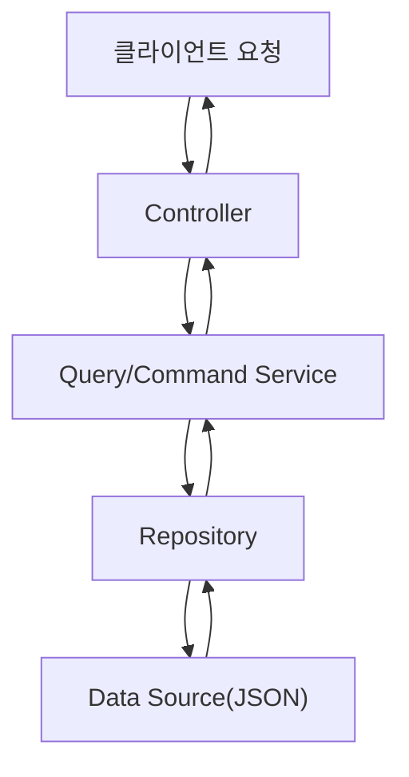

# Winding Road Guide

와인딩 코스 추천 서비스의 풀스택 프로젝트입니다.

## 프로젝트 구조

```
winding-road-guide/
├── frontend/           # Next.js 기반 프론트엔드
└── backend/           # Go 기반 백엔드
```

## 기술 스택

### Frontend
- Next.js 15
- TypeScript
- Tailwind CSS
- Chart.js
- pnpm

### Backend
- Go 1.23.4
- Gin Framework
- Swagger
- Domain-Driven Design

## 시작하기

### Frontend
```bash
cd frontend
pnpm install
pnpm dev
```
- 접속: http://localhost:3000

### Backend
```bash
cd backend
go mod tidy
go run main.go
```
- 접속: http://localhost:8080
- API 문서: http://localhost:8080/swagger/index.html

## API 흐름도


## 주요 기능

### 코스 관리
- 코스 목록 조회
- 코스 상세 정보
- 지역별/스타일별 필터링
- 키워드 검색

### 추천 시스템
- 카테고리별 추천 코스
- 상세 정보 차트
- 안전 수칙 안내

## 최근 업데이트

### UI/UX 개선 (2025년)
- **썸네일 디자인 개선**: 코스 카드의 지도 썸네일을 정사각형으로 변경하여 더 나은 시각적 균형 제공
- **추천 카드 최적화**: 추천 코스 카드에서 불필요한 지도 썸네일 제거, 깔끔한 빈 이미지 영역으로 대체
- **반응형 디자인**: 모든 썸네일에 `aspect-square` 클래스 적용으로 일관된 정사각형 비율 유지

## 상세 문서
- [Frontend 문서](./frontend/README.md)
- [Backend 문서](./backend/README.md)

## 라이선스
MIT License

