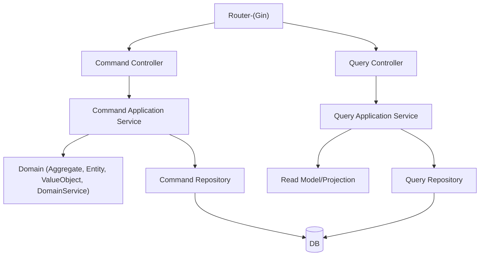

# Backend Architecture (Go + Gin, DDD, CQRS)

## 1. 아키텍처 개요 및 목표

- **도메인 주도 설계(DDD)**와 **CQRS(Command Query Responsibility Segregation)** 패턴을 적용한 Go(Gin) 기반 백엔드 아키텍처입니다.
- 복잡한 비즈니스 로직, 확장성, 유지보수성, 테스트 용이성을 극대화하는 것이 목표입니다.
- 프론트엔드(Next.js)와 REST API로 통신하며, 향후 인증, 이벤트소싱, 멀티DB 등 확장도 고려합니다.

---

## 2. 전체 구조 다이어그램



---

## 3. 계층 및 폴더 구조

```
backend/
  ├── main.go
  ├── go.mod
  ├── config/                  # 환경설정
  ├── interfaces/
  │   ├── routes/              # Gin 라우팅 정의
  │   ├── controllers/
  │   │   ├── command/         # 상태 변경 API
  │   │   └── query/           # 조회 API
  ├── application/
  │   ├── command/             # Command Application Service
  │   └── query/               # Query Application Service
  ├── domain/
  │   ├── course/              # 도메인별 하위 폴더(예시)
  │   │   ├── aggregate.go
  │   │   ├── entity.go
  │   │   ├── valueobject.go
  │   │   ├── repository.go
  │   │   └── service.go
  ├── infrastructure/
  │   ├── persistence/
  │   │   ├── command/         # 쓰기 저장소
  │   │   └── query/           # 읽기 저장소
  │   └── external/            # 외부 API 연동 등
  ├── models/                  # DTO, API 입출력용
  ├── middlewares/             # 인증, 로깅 등
  ├── utils/                   # 공통 유틸
  └── README.md
```

---

## 4. DDD, CQRS 적용 방식

- **DDD**: 도메인(비즈니스 규칙) 중심으로 설계. 도메인 계층에 Aggregate, Entity, ValueObject, DomainService, Repository Interface를 둡니다.
- **CQRS**: Command(상태 변경)와 Query(조회) 책임을 완전히 분리합니다.
  - Command: POST/PUT/DELETE 등 → Command Controller → Command Application → Domain → Command Repository
  - Query: GET 등 → Query Controller → Query Application → Query Repository(Projection/Read Model)
- **Persistence**: Command/Query 저장소를 분리하여 확장성(예: Read/Write DB 분리, Projection 등) 확보

---

## 5. 각 계층/폴더의 책임

- **interfaces/routes**: HTTP 라우팅 및 미들웨어 적용
- **interfaces/controllers/command**: 상태 변경 요청 처리, Command Application 호출
- **interfaces/controllers/query**: 조회 요청 처리, Query Application 호출
- **application/command**: Command 처리용 Application Service, 트랜잭션/비즈니스 흐름 담당
- **application/query**: Query 처리용 Application Service, Projection/Read Model 활용
- **domain/**: 도메인 모델(비즈니스 규칙, 엔티티, 값 객체, 도메인 서비스, 저장소 인터페이스)
- **infrastructure/persistence/command**: Command 저장소 구현(DB, Event Store 등)
- **infrastructure/persistence/query**: Query 저장소 구현(Read DB, Projection 등)
- **models/**: API 입출력용 DTO, Request/Response 구조체
- **middlewares/**: 인증, 로깅, 에러 핸들링 등 공통 미들웨어
- **utils/**: 공통 유틸리티 함수

---

## 6. 예시 요청 흐름

1. **상태 변경(등록/수정/삭제 등)**
   - 클라이언트 → `/api/courses` (POST)
   - Gin Router → Command Controller → Command Application → Domain → Command Repository → DB
   - 결과를 Controller에서 가공 후 JSON 응답

2. **조회(검색/상세 등)**
   - 클라이언트 → `/api/courses` (GET)
   - Gin Router → Query Controller → Query Application → Query Repository → DB(Projection/Read Model)
   - 결과를 Controller에서 가공 후 JSON 응답

---

## 7. 확장성/유지보수 고려사항

- 도메인별 하위 폴더 구조로 확장 용이
- CQRS 구조로 대규모 트래픽/복잡한 비즈니스 로직 대응
- Command/Query 저장소 분리로 Read/Write DB 분리, Projection, 이벤트소싱 등 확장 가능
- 미들웨어, 유틸, 외부 API 연동 등 공통 기능 분리
- 테스트 코드 작성 용이(계층별 단위 테스트)
- Swagger 등 API 문서화, 환경설정 분리, CI/CD 등 실무 적용 고려

---

> 본 아키텍처는 Go(Gin) 기반의 DDD + CQRS 실무 적용을 위한 표준 구조 예시입니다. 실제 프로젝트 상황에 따라 일부 계층/폴더는 통합 또는 분리 조정 가능합니다. 